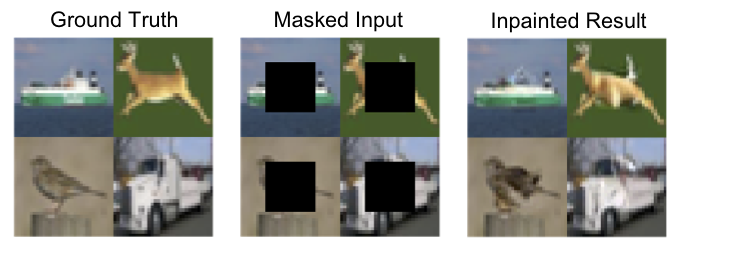

# Parallel and Flexible Sampling from Autoregressive Models via Langevin Dynamics

## Authors
[Vivek Jayaram](http://www.vivekjayaram.com/)**\***, [John Thickstun](https://homes.cs.washington.edu/~thickstn/)**\*** 
*\*Equal Contribution* 
University of Washington

## [Project Page](https://grail.cs.washington.edu/projects/pnf-sampling/)
Video and audio demos are available at the project page

### Paper (Coming Soon)
The Thirty-eighth International Conference on Machine Learning, ICML 2021.

### Summary
We propose a new way to sample from autoregressive models by smoothing the distribution and using the gradients of the likelihood. This allows flexible conditional sampling, and also allows us to parallelize the sampling process. We apply these techniques in the visual and audio domains, with competitive results for audio source separation, super-resolution, and inpainting.

## Instructions
There are two subdirectories, one for audio experiments using a wavenet model and one for small scale image experiments using a pixelcnn++ model. Each directory is independent and contains a Readme for specific running instructions. 

***

